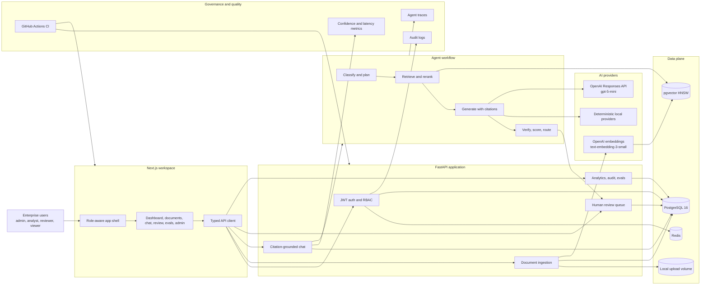

# Enterprise Agentic Knowledge Intelligence Platform

Local-first RAG and governance system for enterprise knowledge workflows.

The platform ingests internal documents, indexes them in PostgreSQL with pgvector, answers questions with citation-grounded retrieval, records agent workflow traces, routes weak answers to human review, and exposes audit, analytics, and evaluation workflows.

## What It Does

- Turns uploaded PDF, TXT, Markdown, and CSV files into searchable document chunks with embeddings.
- Answers natural-language questions using retrieved evidence, citations, confidence scoring, and traceable workflow steps.
- Gives reviewers and admins the controls needed for governed AI output: human review queues, audit logs, analytics, and evaluation runs.

## Capabilities

- FastAPI backend with JWT auth and RBAC roles: admin, analyst, reviewer, viewer.
- Next.js workspace with role-aware navigation and typed API calls.
- Local PostgreSQL plus pgvector and Redis through Docker Compose.
- Upload and process PDF, TXT, Markdown, and CSV files.
- Deterministic local embedding and LLM providers for offline development and tests.
- Optional OpenAI-compatible embedding and chat providers through environment variables.
- Citation-grounded RAG with confidence bands, retrieved evidence, and trace steps.
- Human review queue with approve, edit, reject, and regenerate actions.
- Admin audit logs, analytics, system health, and evaluation runner.
- Sample data and JSONL evaluation cases.
- CI workflow for backend and frontend checks.

## Architecture



## Local Setup

1. Copy `.env.example` to `.env` if you want custom values.
2. Run `docker compose up --build`.
3. Run migrations: `docker compose run --rm backend alembic upgrade head`.
4. Seed local users: `docker compose run --rm backend python -m app.scripts.seed`.
5. Open `http://localhost:3000`.

Seeded local credentials:

- `admin@example.com` / `LocalAdmin123!`
- `analyst@example.com` / `LocalAnalyst123!`
- `reviewer@example.com` / `LocalReviewer123!`
- `viewer@example.com` / `LocalViewer123!`

## OpenAI Configuration

The app works without API keys using mock providers. To use OpenAI-compatible providers locally:

```env
EMBEDDING_PROVIDER=openai
LLM_PROVIDER=openai
OPENAI_API_KEY=sk-...
OPENAI_EMBEDDING_MODEL=text-embedding-3-small
OPENAI_CHAT_MODEL=gpt-5-mini
MAX_OUTPUT_TOKENS=1200
OPENAI_REASONING_EFFORT=minimal
OPENAI_TEXT_VERBOSITY=low
RAG_TOP_K=8
RAG_MAX_CONTEXT_CHARS=12000
CITATION_MAX_CHARS=360
```

Token controls:

- Use `text-embedding-3-small` for low-cost embeddings.
- Use `gpt-5-mini` as the default chat model.
- Keep `top_k` at 8 or lower for normal questions.
- Cap retrieved context with `RAG_MAX_CONTEXT_CHARS`.
- Keep `MAX_OUTPUT_TOKENS` near 1200 for board-level summaries; use lower values for short Q&A.
- Use `OPENAI_REASONING_EFFORT=minimal` and `OPENAI_TEXT_VERBOSITY=low` for low-latency, low-token grounded answers.
- Route low-confidence answers to review instead of asking the model to over-explain.

The OpenAI provider uses the Responses API for model calls. See [OpenAI models](https://platform.openai.com/docs/models), [Responses API](https://platform.openai.com/docs/api-reference/responses), and [pricing](https://platform.openai.com/docs/pricing/).

## Common Commands

```bash
make up
make migrate
make seed
make backend-test
make backend-lint
make backend-typecheck
make frontend-typecheck
make frontend-build
make verify
```

## Verification

The repository includes backend linting, backend tests, backend type checks, frontend type checks, and frontend production builds.

```bash
cd backend
python -m ruff check .
python -m pytest
python -m mypy app

cd ../frontend
npm run typecheck
npm run build
```

For a live OpenAI smoke test after configuring `.env`, run:

```powershell
powershell -ExecutionPolicy Bypass -File scripts/run-openai-integration.ps1
```

The smoke test uploads five sample documents, processes them, asks five citation-grounded questions, checks trace coverage, reads review and analytics endpoints, and runs an evaluation.

## API Examples

Log in:

```bash
curl -s http://localhost:8000/auth/login \
  -H "Content-Type: application/json" \
  -d '{"email":"admin@example.com","password":"LocalAdmin123!"}'
```

Upload and process a document:

```bash
curl -s http://localhost:8000/documents/upload \
  -H "Authorization: Bearer $TOKEN" \
  -F "file=@demo-data/company-annual-report-ai-risk.md"

curl -s -X POST http://localhost:8000/documents/$DOCUMENT_ID/process \
  -H "Authorization: Bearer $TOKEN"
```

Ask a grounded question:

```bash
curl -s http://localhost:8000/chat/query \
  -H "Authorization: Bearer $TOKEN" \
  -H "Content-Type: application/json" \
  -d '{"question":"Summarize the main AI infrastructure risks across the uploaded annual reports.","top_k":8}'
```

## Workflow

1. Log in as analyst.
2. Upload sample files from `demo-data`.
3. Process each document.
4. Ask questions in Chat.
5. Inspect answer citations, confidence, evidence, and trace.
6. Log in as reviewer/admin to process review items.
7. Run evaluations from the Evaluations page.
8. Inspect audit logs and analytics as admin.

## Documentation

- [Architecture](docs/architecture.md)
- [Database Plan](docs/database.md)
- [API](docs/api.md)
- [Security](docs/security.md)
- [Evaluation](docs/evaluation.md)
- [Local Development](docs/local-development.md)
- [Walkthrough](docs/demo-script.md)
- [OpenAI Token Plan](docs/openai-token-plan.md)
