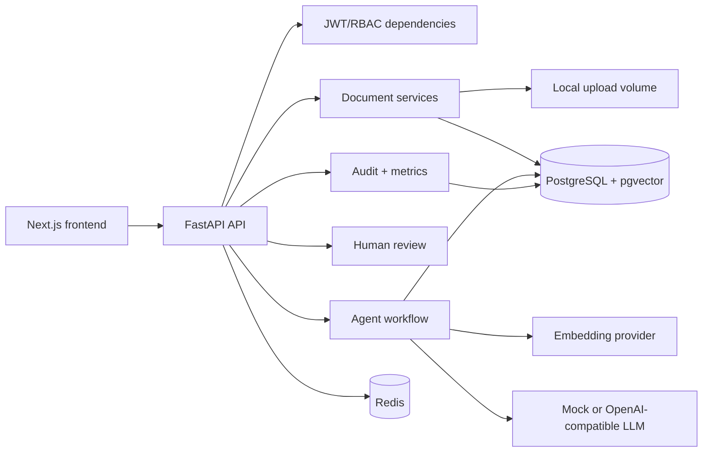

# Enterprise Agentic Knowledge Intelligence Platform

Portfolio-grade local enterprise AI product for AI Engineer, GenAI Engineer, Agentic AI Builder, LLMOps Engineer, and Data Scientist roles.

The platform ingests AI research notes and company annual report excerpts, chunks and embeds them into local PostgreSQL with pgvector, answers questions with citation-grounded RAG, records product-level LangGraph-style traces, routes weak answers to human review, and exposes audit, analytics, and evaluation workflows.

## Why It Matters

This repository demonstrates practical enterprise AI engineering: auth, RBAC, document ingestion, vector search, grounded generation, confidence scoring, human oversight, observability, evaluations, Dockerized local infrastructure, and production-oriented documentation.

## Features

- FastAPI backend with JWT auth and RBAC roles: admin, analyst, reviewer, viewer.
- Next.js enterprise SaaS frontend with role-aware navigation.
- Local PostgreSQL plus pgvector and Redis through Docker Compose.
- Upload and process PDF, TXT, Markdown, and CSV files.
- Deterministic mock embedding and LLM providers for free local demos.
- Optional OpenAI-compatible embedding and chat providers through environment variables.
- Citation-grounded RAG with confidence bands, retrieved evidence, and trace steps.
- Human review queue with approve, edit, reject, and regenerate actions.
- Admin audit logs, analytics, system health, and evaluation runner.
- Demo data and JSONL evaluation cases.
- CI workflow for backend and frontend checks.

## Architecture



## Local Setup

1. Copy `.env.example` to `.env` if you want custom values.
2. Run `docker compose up --build`.
3. Run migrations: `docker compose run --rm backend alembic upgrade head`.
4. Seed demo users: `docker compose run --rm backend python -m app.scripts.seed`.
5. Open `http://localhost:3000`.

Seeded local demo credentials:

- `admin@example.com` / `LocalAdmin123!`
- `analyst@example.com` / `LocalAnalyst123!`
- `reviewer@example.com` / `LocalReviewer123!`
- `viewer@example.com` / `LocalViewer123!`

## OpenAI Configuration

The app works without API keys using mock providers. To use OpenAI-compatible providers locally:

```env
EMBEDDING_PROVIDER=openai
LLM_PROVIDER=openai
OPENAI_API_KEY=sk-...
OPENAI_EMBEDDING_MODEL=text-embedding-3-small
OPENAI_CHAT_MODEL=gpt-5-mini
MAX_OUTPUT_TOKENS=900
RAG_TOP_K=8
RAG_MAX_CONTEXT_CHARS=12000
CITATION_MAX_CHARS=360
```

Token efficiency plan:

- Use `text-embedding-3-small` for low-cost embeddings.
- Use `gpt-5-mini` as the default cost-efficient reasoning/chat model.
- Keep `top_k` at 8 or lower for normal questions.
- Cap retrieved context with `RAG_MAX_CONTEXT_CHARS`.
- Keep `MAX_OUTPUT_TOKENS` under 900 for board-level summaries.
- Route low-confidence answers to review instead of asking the model to over-explain.

Official OpenAI docs currently list `gpt-5-mini` as a faster, cost-efficient GPT-5 option and `text-embedding-3-small` as the low-cost embedding model. The OpenAI provider uses the Responses API for model calls. See [OpenAI models](https://platform.openai.com/docs/models), [Responses API](https://platform.openai.com/docs/api-reference/responses), and [pricing](https://platform.openai.com/docs/pricing/).

## Common Commands

```bash
make up
make migrate
make seed
make backend-test
make backend-lint
make backend-typecheck
make frontend-typecheck
make frontend-build
make verify
```

## Workflow

1. Log in as analyst.
2. Upload files from `demo-data`.
3. Process each document.
4. Ask questions in Chat.
5. Inspect answer citations, confidence, evidence, and trace.
6. Log in as reviewer/admin to process review items.
7. Run evaluations from the Evaluations page.
8. Inspect audit logs and analytics as admin.

## What Is Not Included Yet

- Supabase implementation.
- Cloud deployment.
- Enterprise SSO.
- Billing or payments.
- Real Slack/Jira/GitHub automation integrations.
- Web crawling or email ingestion.

## Documentation

- [Architecture](docs/architecture.md)
- [Database Plan](docs/database.md)
- [API](docs/api.md)
- [Security](docs/security.md)
- [Evaluation](docs/evaluation.md)
- [Local Development](docs/local-development.md)
- [Future Supabase Plan](docs/future-supabase-plan.md)
- [Future Deployment Plan](docs/future-deployment-plan.md)
- [Demo Script](docs/demo-script.md)
- [OpenAI Token Plan](docs/openai-token-plan.md)

## Resume Bullets

- Built a local enterprise RAG platform with FastAPI, Next.js, PostgreSQL/pgvector, Redis, JWT/RBAC, and Docker Compose.
- Implemented document ingestion, deterministic mock embeddings, optional OpenAI-compatible providers, vector search, citation verification, confidence scoring, and human review.
- Added audit logs, admin analytics, evaluation workflows, CI, and production-oriented architecture/security/deployment documentation.
