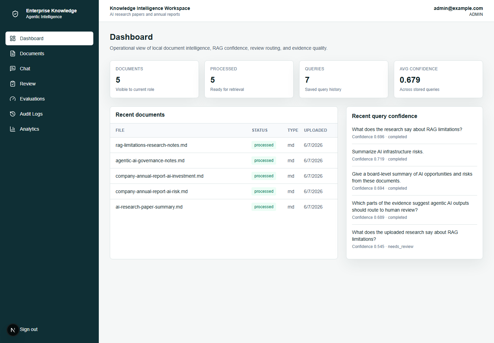
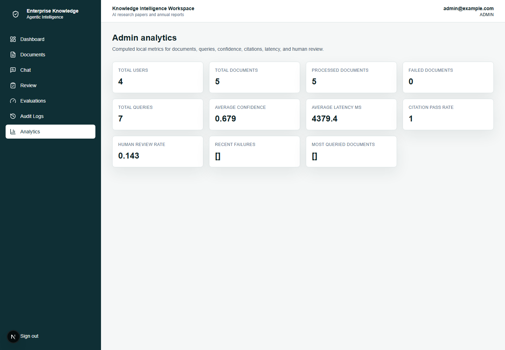

# Enterprise Agentic Knowledge Intelligence Platform

Portfolio-grade local enterprise AI product for AI Engineer, GenAI Engineer, Agentic AI Builder, LLMOps Engineer, and Data Scientist roles.

The platform ingests AI research notes and company annual report excerpts, chunks and embeds them into local PostgreSQL with pgvector, answers questions with citation-grounded RAG, records product-level LangGraph-style traces, routes weak answers to human review, and exposes audit, analytics, and evaluation workflows.

## Product Screenshots

Real local product run with Docker Compose, seeded demo users, processed demo documents, mock embeddings, and mock LLM providers.





## Why It Matters

This repository demonstrates practical enterprise AI engineering: auth, RBAC, document ingestion, vector search, grounded generation, confidence scoring, human oversight, observability, evaluations, Dockerized local infrastructure, and production-oriented documentation.

## Features

- FastAPI backend with explicit-secret JWT auth, HttpOnly browser sessions, and server-enforced RBAC.
- Next.js enterprise SaaS frontend with role-aware navigation.
- Local PostgreSQL plus pgvector and Redis through Docker Compose.
- Upload and process PDF, TXT, Markdown, and CSV files.
- Deterministic mock embedding and LLM providers for free local demos.
- Optional OpenAI-compatible embedding and chat providers through environment variables.
- Citation-grounded RAG with confidence bands, retrieved evidence, and trace steps.
- Human review queue with approve, edit, reject, and regenerate actions.
- Admin audit logs, analytics, system health, and evaluation runner.
- Demo data and JSONL evaluation cases.
- CI workflow for backend and frontend checks.

## Security and role model

Public registration has one outcome: a `viewer` account. The request contract contains no role field, and the server assigns `viewer` unconditionally. Elevated access is a trusted administrative operation; the local seed script is the only provisioning mechanism shipped here.

| Capability | Viewer | Analyst | Reviewer | Admin |
| --- | :---: | :---: | :---: | :---: |
| Read processed documents and ask grounded questions | Yes | Yes | Yes | Yes |
| Upload/process/delete own documents | No | Yes | No | Yes |
| Review low-confidence answers | No | No | Yes | Yes |
| Run evaluations, view users/audit/analytics | No | No | No | Yes |
| Read another user's chat sessions, traces, or citations | No | No | No | Admin only |

The browser never receives a token body or writes credentials to `localStorage` or `sessionStorage`. Web login sets a `HttpOnly; SameSite=Strict` cookie; cookie-authenticated mutations require an exact allowlisted `Origin`. CORS credentials are allowed only for explicitly configured origins. Non-browser clients request a bearer token from the separate `/auth/token` endpoint. `JWT_SECRET` is mandatory and must be at least 32 characters. Production configuration additionally requires `AUTH_COOKIE_SECURE=true`, so an omitted secret or insecure production cookie fails startup rather than silently weakening authentication.

Document content is untrusted data, never agent instruction. Retrieval is limited to processed workspace documents; requested document filters can narrow that set but cannot expand it. Citation verification accepts only references to retrieved chunks, persists the source quote from that chunk, and routes missing/invalid support toward low confidence and human review. This supports evidence traceability, not proof that every generated sentence is semantically entailed.

## Architecture


```mermaid
flowchart TB
  %% Enterprise Agentic Knowledge Intelligence Platform

  subgraph People["Enterprise Users"]
    Admin["Admin<br/>analytics, users, audit logs, evals"]
    Analyst["Analyst<br/>upload, process, ask questions"]
    Reviewer["Reviewer<br/>approve, edit, reject, regenerate"]
    Viewer["Viewer<br/>ask questions, view processed knowledge"]
  end

  subgraph Experience["Experience Layer - Next.js 16 + TypeScript"]
    Web["Role-aware SaaS workspace<br/>dashboard, documents, chat, review, evals, admin"]
    Client["Typed API client<br/>HttpOnly session cookie, loading states, errors, empty states"]
  end

  subgraph API["Application Layer - FastAPI"]
    Gateway["API router<br/>/auth /documents /chat /review /evals /admin"]
    Security["Security boundary<br/>JWT auth, RBAC, CORS, rate limiting, safe errors"]
    Schemas["Pydantic v2 contracts<br/>validated requests and responses"]
  end

  subgraph Services["Domain Services"]
    Auth["Auth service<br/>bcrypt password hashing, token issuance, demo seed users"]
    Ingestion["Document ingestion<br/>type validation, safe filenames, hashing, local storage"]
    Processing["Processing pipeline<br/>PDF/TXT/MD/CSV parsing, prompt-injection detection, chunking"]
    Retrieval["Retrieval service<br/>query embedding, pgvector cosine search, filters, evidence snippets"]
    Chat["RAG persistence<br/>sessions, messages, queries, citations, latency, cost estimate"]
    Review["Human review workflow<br/>low-confidence routing and reviewer actions"]
    Evals["Evaluation runner<br/>local JSONL cases, keyword coverage, citation metrics, pass rate"]
    AdminOps["Admin analytics<br/>usage, confidence, latency, failures, review rate"]
  end

  subgraph Agent["Agentic Reasoning Layer - LangGraph"]
    Classifier["1. Question classifier"]
    Planner["2. Retrieval planner"]
    Retriever["3. Retriever"]
    Reranker["4. Reranker"]
    Generator["5. Answer generator"]
    Verifier["6. Citation verifier"]
    Critic["7. Critic"]
    Scorer["8. Confidence scorer"]
    Decision["9. Human review decision"]
    Final["10. Final response builder"]
    Classifier --> Planner --> Retriever --> Reranker --> Generator --> Verifier --> Critic --> Scorer --> Decision --> Final
  end

  subgraph Providers["AI Provider Boundary"]
    MockEmb["Mock embeddings<br/>deterministic, free, test-safe"]
    MockLLM["Mock LLM<br/>grounded local demo answers"]
    OpenAIEmb["OpenAI-compatible embeddings<br/>text-embedding-3-small"]
    OpenAIResp["OpenAI Responses API<br/>gpt-5-mini, capped context and output"]
  end

  subgraph Data["Local Data Plane"]
    Postgres[("PostgreSQL 16<br/>system of record")]
    Vector[("pgvector HNSW index<br/>document chunk embeddings")]
    Redis[("Redis<br/>rate limit/cache ready")]
    Uploads[("Local upload volume<br/>original files")]
    Demo["demo-data<br/>safe generated research and annual report excerpts"]
  end

  subgraph Observability["Governance, Evaluation, and Observability"]
    Audit["Audit logs<br/>auth, upload, processing, query, review, eval, admin access"]
    Traces["Agent traces<br/>node summaries, status, latency, errors"]
    Metrics["System metrics<br/>confidence, latency, citation pass rate, review rate"]
    CI["GitHub Actions CI<br/>backend lint/typecheck/tests, frontend typecheck/build"]
    Docs["Architecture, API, security, database, evals, Supabase and deployment plans"]
  end

  subgraph Future["Future Boundary - intentionally not implemented yet"]
    Supabase["Supabase plan<br/>Postgres, Auth, Storage, pgvector migration"]
    Deploy["Deployment plan<br/>managed frontend, backend, database, Redis, secrets"]
  end

  Admin --> Web
  Analyst --> Web
  Reviewer --> Web
  Viewer --> Web
  Web --> Client --> Gateway
  Gateway --> Security --> Schemas
  Gateway --> Auth
  Gateway --> Ingestion
  Gateway --> Processing
  Gateway --> Retrieval
  Gateway --> Chat
  Gateway --> Review
  Gateway --> Evals
  Gateway --> AdminOps

  Ingestion --> Uploads
  Ingestion --> Postgres
  Processing --> Uploads
  Processing --> MockEmb
  Processing --> OpenAIEmb
  Processing --> Postgres
  Processing --> Vector
  Retrieval --> MockEmb
  Retrieval --> OpenAIEmb
  Retrieval --> Vector
  Chat --> Agent
  Agent --> MockLLM
  Agent --> OpenAIResp
  Agent --> Chat
  Chat --> Postgres
  Review --> Postgres
  Evals --> Agent
  Evals --> Postgres
  AdminOps --> Postgres
  Security --> Redis
  Demo --> Ingestion

  Gateway --> Audit
  Agent --> Traces
  Chat --> Metrics
  Audit --> Postgres
  Traces --> Postgres
  Metrics --> Postgres
  CI -. validates .-> API
  CI -. validates .-> Experience
  Docs -. explains .-> Future

  Postgres -. future migration .-> Supabase
  Uploads -. future migration .-> Supabase
  Experience -. future deployment .-> Deploy
  API -. future deployment .-> Deploy

  classDef user fill:#ecfeff,stroke:#0891b2,color:#083344
  classDef app fill:#eef2ff,stroke:#4f46e5,color:#1e1b4b
  classDef service fill:#f8fafc,stroke:#64748b,color:#0f172a
  classDef agent fill:#f0fdf4,stroke:#16a34a,color:#052e16
  classDef provider fill:#fff7ed,stroke:#ea580c,color:#431407
  classDef data fill:#fefce8,stroke:#ca8a04,color:#422006
  classDef obs fill:#fdf2f8,stroke:#db2777,color:#500724
  classDef future fill:#fafafa,stroke:#737373,stroke-dasharray: 6 4,color:#171717

  class Admin,Analyst,Reviewer,Viewer user
  class Web,Client,Gateway,Security,Schemas app
  class Auth,Ingestion,Processing,Retrieval,Chat,Review,Evals,AdminOps service
  class Classifier,Planner,Retriever,Reranker,Generator,Verifier,Critic,Scorer,Decision,Final agent
  class MockEmb,MockLLM,OpenAIEmb,OpenAIResp provider
  class Postgres,Vector,Redis,Uploads,Demo data
  class Audit,Traces,Metrics,CI,Docs obs
  class Supabase,Deploy future
```

## Local Setup

1. Copy `.env.example` to `.env` if you want custom values.
2. Replace the example `JWT_SECRET` with a unique random value of at least 32 characters (and set `AUTH_COOKIE_SECURE=true` outside local HTTP development).
3. Run `docker compose up --build`.
4. Run migrations: `docker compose run --rm backend alembic upgrade head`.
5. Seed demo users: `docker compose run --rm backend python -m app.scripts.seed`.
6. Open `http://localhost:3000`.

Seeded local demo credentials:

- `admin@example.com` / `LocalAdmin123!`
- `analyst@example.com` / `LocalAnalyst123!`
- `reviewer@example.com` / `LocalReviewer123!`
- `viewer@example.com` / `LocalViewer123!`

## OpenAI Configuration

The default path is deterministic and makes no network calls: mock embeddings are hash-derived and the mock answerer quotes retrieved chunks. It is suitable for development, screenshots, CI, and the shipped retrieval evaluation, but it is not a quality proxy for a production model. To opt into OpenAI-compatible providers locally:

```env
EMBEDDING_PROVIDER=openai
LLM_PROVIDER=openai
OPENAI_API_KEY=sk-...
OPENAI_EMBEDDING_MODEL=text-embedding-3-small
OPENAI_CHAT_MODEL=gpt-5-mini
MAX_OUTPUT_TOKENS=1200
OPENAI_REASONING_EFFORT=minimal
OPENAI_TEXT_VERBOSITY=low
RAG_TOP_K=8
RAG_MAX_CONTEXT_CHARS=12000
CITATION_MAX_CHARS=360
```

Token efficiency plan:

- Use `text-embedding-3-small` for low-cost embeddings.
- Use `gpt-5-mini` as the default cost-efficient reasoning/chat model.
- Keep `top_k` at 8 or lower for normal questions.
- Cap retrieved context with `RAG_MAX_CONTEXT_CHARS`.
- Keep `MAX_OUTPUT_TOKENS` near 1200 for board-level summaries; use lower values for short Q&A demos.
- Use `OPENAI_REASONING_EFFORT=minimal` and `OPENAI_TEXT_VERBOSITY=low` for low-latency, low-token grounded answers.
- Route low-confidence answers to review instead of asking the model to over-explain.

There is no runtime dollar budget or exact price calculator in this repository. `estimated_cost` remains `0.0`; treat provider-console usage as the billing source of truth. Provider calls occur only when `EMBEDDING_PROVIDER=openai` or `LLM_PROVIDER=openai` and require `OPENAI_API_KEY`. Tests do not make paid calls.

Official OpenAI docs currently list `gpt-5-mini` as a faster, cost-efficient GPT-5 option and `text-embedding-3-small` as the low-cost embedding model. The OpenAI provider uses the Responses API for model calls. See [OpenAI models](https://platform.openai.com/docs/models), [Responses API](https://platform.openai.com/docs/api-reference/responses), and [pricing](https://platform.openai.com/docs/pricing/).

## Common Commands

```bash
make up
make migrate
make seed
make backend-test
make backend-lint
make backend-typecheck
make frontend-typecheck
make frontend-build
make verify
```

`make verify` runs backend lint and tests, frontend type checking/build, and Compose configuration validation. Backend type checking is available separately as `make backend-typecheck`. The corpus evaluation is deterministic and deliberately includes a fabricated negative case to show that the gate can fail. These checks cover contracts and core security behavior; this repository does not currently ship a Playwright/Cypress browser suite or load/penetration testing.

## Operations

- Apply Alembic migrations before starting a new application version; do not rely on test-only table creation.
- Keep `JWT_SECRET` in a managed secret store, rotate it through an explicit all-sessions logout window, terminate TLS at a trusted boundary, and enable `AUTH_COOKIE_SECURE=true`.
- Back up PostgreSQL and the upload volume together; a database-only restore leaves document records pointing at missing files. Restore procedures are deployment-owned and are not automated here.
- Monitor health, 401/403 rates, upload/process failures, query latency, low-confidence review volume, and provider spend. The shipped in-memory limiter is per process and is not a distributed abuse control.
- Restrict CORS to the deployed frontend origin. The frontend/API should remain within one trusted site because the browser session relies on SameSite cookies.

## Threat model and honest limits

The implemented controls target privilege escalation at registration, browser token exfiltration through Web Storage, weak fallback signing keys, horizontal chat-session access, unauthorized document mutation, path traversal, oversized/unsupported uploads, invalid citation references, and common prompt-injection phrases. Audit records cover important actions and denied RBAC checks, but they are mutable rows in the same database—not a tamper-proof ledger.

This is a single-workspace portfolio system, not a multi-tenant SaaS. All authenticated users can retrieve all processed workspace documents. There is no organization boundary, row-level tenant policy, SSO/MFA, session revocation list, malware/CDR pipeline, object storage, distributed rate limiting, CSP/reporting pipeline, or guaranteed disaster recovery. Do not place confidential multi-tenant data in this build without adding and independently testing those controls.

## Workflow

1. Log in as analyst.
2. Upload files from `demo-data`.
3. Process each document.
4. Ask questions in Chat.
5. Inspect answer citations, confidence, evidence, and trace.
6. Log in as reviewer/admin to process review items.
7. Run evaluations from the Evaluations page.
8. Inspect audit logs and analytics as admin.

## What Is Not Included Yet

- Supabase implementation.
- Cloud deployment.
- Enterprise SSO.
- Billing or payments.
- Real Slack/Jira/GitHub automation integrations.
- Web crawling or email ingestion.
- Multi-tenant isolation and organization-scoped document ACLs.
- Automated end-to-end browser, load, or penetration tests.

## Documentation

- [Architecture](docs/architecture.md)
- [Database Plan](docs/database.md)
- [API](docs/api.md)
- [Security](docs/security.md)
- [Evaluation](docs/evaluation.md)
- [Local Development](docs/local-development.md)
- [Future Supabase Plan](docs/future-supabase-plan.md)
- [Future Deployment Plan](docs/future-deployment-plan.md)
- [Demo Script](docs/demo-script.md)
- [OpenAI Token Plan](docs/openai-token-plan.md)

## Resume Bullets

- Built a local enterprise RAG platform with FastAPI, Next.js, PostgreSQL/pgvector, Redis, JWT/RBAC, and Docker Compose.
- Implemented document ingestion, deterministic mock embeddings, optional OpenAI-compatible providers, vector search, citation verification, confidence scoring, and human review.
- Added audit logs, admin analytics, evaluation workflows, CI, and production-oriented architecture/security/deployment documentation.

## License

All rights reserved. This repository is public for portfolio and recruitment review. Reuse, redistribution, or commercial use requires explicit written permission from Karthik Ramesh.
