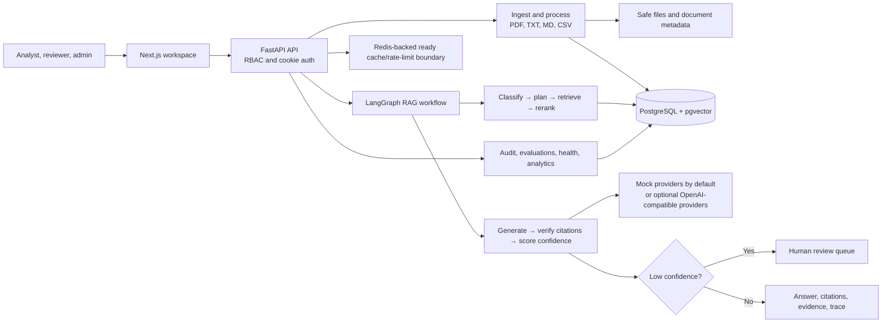

# Enterprise Agentic Knowledge Intelligence Platform

> Turn a shared document library into answers people can inspect, challenge, and route to a human when the evidence is weak.

This is a local-first RAG product for the moment an analyst needs a concise answer from research notes or annual-report excerpts, but cannot treat an LLM response as the source of truth. It pairs a role-aware workspace with evidence retrieval, citations, confidence, agent traces, review, evaluation, and auditability.

**Product outcome:** reduce the work of locating and synthesising source material while preserving a clear path back to the evidence and a human decision when the system is uncertain.


## The user problem

Knowledge workers often have the documents but not a reliable way to turn them into a defensible answer. Search returns too much context; chat can sound confident without showing its basis; and a “helpful” assistant can accidentally blur the line between retrieved content and generated interpretation.

The product is designed around three jobs:

| User | Job to be done | Product response |
| --- | --- | --- |
| Analyst | Turn approved documents into a concise answer with sources | Upload, process, ask, inspect evidence and citations |
| Reviewer | Intervene when the answer is insufficient or risky | Work a low-confidence queue; approve, edit, reject, or regenerate |
| Admin | Understand how the system is used and whether it is behaving as intended | Inspect evaluations, audit events, health, usage, latency, confidence, and review volume |

## Product journey

1. An analyst uploads PDF, TXT, Markdown, or CSV material and processes it into chunks and embeddings.
2. They ask a question. The RAG workflow retrieves relevant processed chunks, produces a grounded response, and records citations, confidence, latency, and trace steps.
3. The analyst opens citation cards and retrieved evidence instead of accepting the answer at face value.
4. Weak or unsupported answers are routed to a reviewer, who can approve, edit, reject, or regenerate.
5. An admin runs local evaluation cases and uses the audit and analytics views to watch product behaviour.

The included `demo-data` and seeded roles support this flow without a provider key or paid API calls.

## What makes this a product—not just a RAG demo

- **Evidence is part of the answer.** Responses carry citations to retrieved chunks and saved source quotes; invalid or missing support lowers confidence and can trigger review.
- **Model output has no authority.** Documents are treated as untrusted data, not instructions. Retrieval is restricted to processed workspace content; requested document filters may narrow results but cannot expand them.
- **Oversight is a workflow.** Low-confidence answers move into a reviewer queue rather than asking the model to compensate with more prose.
- **The system is observable.** Agent-node summaries, errors, latency, confidence, evaluations, and key actions are persisted for product and operational inspection.
- **The demo is repeatable.** Hash-derived mock embeddings and a local grounded answerer make the default flow deterministic and offline.

## Architecture


```mermaid
flowchart LR
  U[Analyst, reviewer, admin] --> W[Next.js workspace]
  W --> A[FastAPI API\nRBAC and cookie auth]
  A --> I[Ingest and process\nPDF, TXT, MD, CSV]
  I --> F[Safe files and document metadata]
  I --> V[(PostgreSQL + pgvector)]
  A --> R[LangGraph RAG workflow]
  R --> Q[Classify → plan → retrieve → rerank]
  Q --> V
  R --> G[Generate → verify citations → score confidence]
  G --> P[Mock providers by default\nor optional OpenAI-compatible providers]
  G --> H{Low confidence?}
  H -->|Yes| RV[Human review queue]
  H -->|No| AN[Answer, citations, evidence, trace]
  A --> O[Audit, evaluations, health, analytics]
  O --> V
  A --> L[Redis-backed ready cache/rate-limit boundary]
```

## Technology

| Layer | Implementation |
| --- | --- |
| Product UI | Next.js 16, React 19, TypeScript, Tailwind |
| Application API | FastAPI, Pydantic, SQLAlchemy, Alembic |
| Knowledge store | PostgreSQL 16, pgvector HNSW index, local upload volume |
| RAG orchestration | LangGraph-style workflow with retrieval, reranking, citation verification, critique, and confidence scoring |
| Providers | Deterministic mock embeddings/answerer by default; optional OpenAI-compatible embeddings and Responses API |
| Local operations | Docker Compose, Redis, Make, GitHub Actions |
| Quality gates | Pytest, Ruff, mypy, TypeScript type checking, production frontend build |

## Demo in five minutes

Requirements: Docker with Compose.

```bash
cp .env.example .env
make up
```

In a second terminal, apply the schema and load the safe demo accounts:

```bash
make migrate
make seed
```

Open `http://localhost:3000`, sign in as `analyst@example.com` with `LocalAnalyst123!`, upload files from `demo-data`, process them, and ask:

> Summarize the main AI infrastructure risks across the uploaded annual reports.

Then inspect the citations, evidence, confidence badge, and trace. Ask a deliberately weak question to see the human-review path; use `reviewer@example.com` / `LocalReviewer123!` to make the review decision and `admin@example.com` / `LocalAdmin123!` to run evaluations and inspect analytics. See the full [demo script](docs/demo-script.md).

Other local seed roles: `reviewer@example.com` / `LocalReviewer123!`, `viewer@example.com` / `LocalViewer123!`. These are demonstration credentials only.

## Design decisions and tradeoffs

| Decision | Why it matters | Tradeoff |
| --- | --- | --- |
| Deterministic providers by default | Demos, tests, and evaluation runs work offline with no spend | It is not a production-quality proxy for a hosted model |
| Citations and saved evidence | Makes an answer inspectable instead of merely plausible | Citation presence does not prove semantic entailment for every sentence |
| Human review on weak answers | Provides a safe recovery path instead of false certainty | Introduces review work and does not automate the business decision |
| Local PostgreSQL + pgvector | Makes data flow and vector retrieval concrete and reproducible | The current implementation is a single shared workspace, not tenant-isolated SaaS |
| Optional provider adapter | Lets teams test OpenAI-compatible embeddings and chat without changing the product flow | Enabling it sends configured content to that provider and introduces usage cost |

## Guardrails and measurable limits

These are enforced or configured defaults, not benchmark claims.

| Control | Default |
| --- | ---: |
| Upload size | 10 MiB (`MAX_UPLOAD_SIZE_BYTES=10485760`) |
| Retrieval depth | 8 chunks (`RAG_TOP_K`) |
| Retrieved context | 12,000 characters (`RAG_MAX_CONTEXT_CHARS`) |
| Citation quote length | 360 characters (`CITATION_MAX_CHARS`) |
| Model output cap when enabled | 1,200 tokens (`MAX_OUTPUT_TOKENS`) |
| In-process rate limit | 60 requests/minute (configurable) |

The evaluation runner uses local JSONL questions through the same RAG path and records keyword coverage, citation count and verification pass rate, confidence, latency, estimated token usage, and pass/fail. It is a regression signal—not a claim of general RAG quality.

## Verification

```bash
make verify
make evals
```

`make verify` runs backend linting and tests, frontend type checking and production build, plus Compose configuration validation. `make evals` runs the deterministic corpus evaluation after the stack is available. Tests do not call paid providers. There is no shipped browser E2E, load, or penetration suite.

## Security and scope boundaries

Authentication uses bcrypt-hashed passwords, a required 32+ character JWT secret, `HttpOnly; SameSite=Strict` browser sessions, origin checks for cookie-authenticated mutations, and server-enforced roles. Public registration always creates a viewer; only trusted local provisioning creates elevated demo roles. Production cookie configuration fails closed unless `AUTH_COOKIE_SECURE=true` is set.

This is a portfolio-grade, single-workspace reference build. It does not provide organization-level tenant isolation, document ACLs, SSO/MFA, session revocation, tamper-proof audit storage, malware/CDR scanning, object storage, distributed rate limiting, cloud deployment, or guaranteed disaster recovery. Do not use it for confidential multi-tenant data without adding and independently validating those controls.

Further reading: [architecture](docs/architecture.md), [API](docs/api.md), [security](docs/security.md), [evaluation](docs/evaluation.md), [local development](docs/local-development.md), and the [token plan](docs/openai-token-plan.md).

## License

All rights reserved. Public for portfolio and recruitment review; reuse, redistribution, or commercial use requires written permission from Karthik Ramesh.
