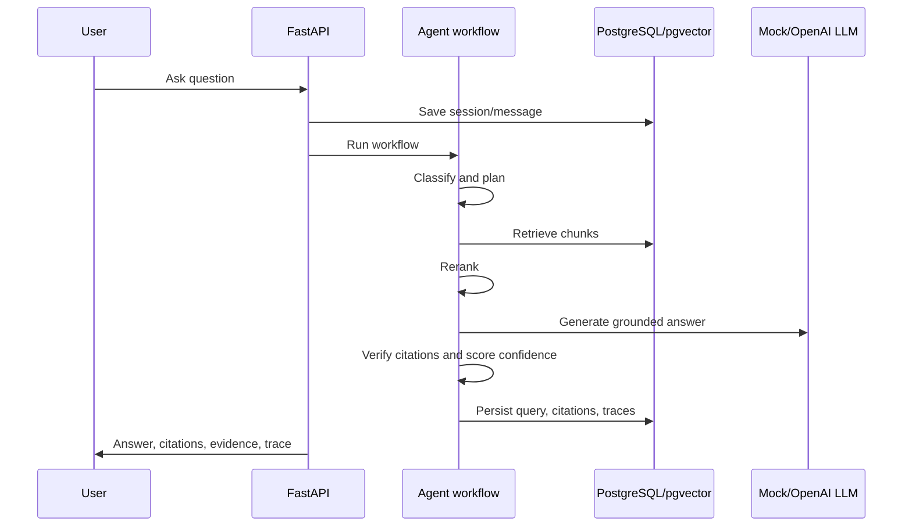

# Architecture

The platform is a local-first monorepo with a FastAPI backend, Next.js frontend, PostgreSQL/pgvector database, Redis, and local upload storage.

## Backend

FastAPI exposes auth, documents, chat, review, eval, and admin routes. SQLAlchemy models define the data contract. Alembic creates the reproducible PostgreSQL schema.

## Frontend

Next.js provides a protected enterprise SaaS shell with dashboard, documents, chat, review, evaluations, audit logs, and analytics screens. The frontend uses a typed API wrapper and stores JWT locally for the local demo.

## RAG Flow

## Human Review

Low-confidence or citation-weak answers create review items. Reviewer/admin users can approve, edit, reject, or regenerate answers. Actions are audit logged.

## Evaluation

Evaluation runs use local JSONL-style cases and mock providers by default. Metrics include keyword coverage, citation count, pass rate, confidence, and latency.

## Observability

Audit logs and system metrics are stored locally. Admin analytics computes counts, confidence averages, latency, citation pass rate, and review rate from stored data.

