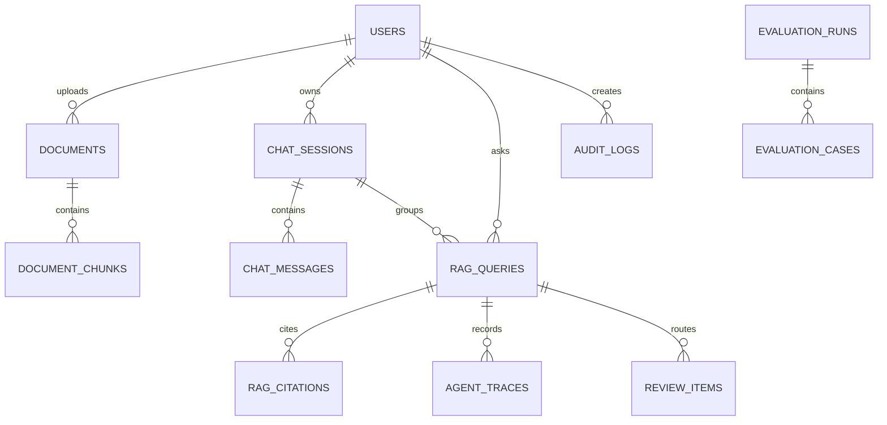

# Database Plan

## Goals

The database supports local enterprise RAG workflows: users, RBAC, document ingestion, chunk storage, embeddings, chat persistence, citations, traces, review, evaluations, audit logs, and metrics. PostgreSQL is the system of record and pgvector stores chunk embeddings.

## Core Schema

## Tables

`users`

- Stores UUID, email, password hash, role, timestamps.
- Indexed by email and role.
- Passwords are never stored in plaintext.

`documents`

- Stores uploaded file metadata, safe local storage path, content hash, status, processing errors, and prompt-injection warnings.
- Indexed by status, uploaded_by, document_type, and content_hash.
- Duplicate detection uses `(content_hash, uploaded_by)`.

`document_chunks`

- Stores deterministic chunks with page/section metadata and embedding vector.
- Uses pgvector `Vector(EMBEDDING_DIMENSION)`.
- Indexed by document id and chunk order.
- IVFFlat cosine index is created for practical vector search.

`chat_sessions` and `chat_messages`

- Persist conversation sessions and messages.
- Sessions are owned by users.

`rag_queries`

- Stores question, rewritten question, final answer, confidence, status, latency, estimated token count, and estimated cost.
- Status indicates completed, needs_review, or failed.

`rag_citations`

- Links answers to document chunks.
- Stores quote, relevance score, page number, and verification status.

`agent_traces`

- Stores product-level node traces: classifier, planner, retriever, reranker, answer generator, citation verifier, critic, confidence scorer, review decision, and final response builder.

`review_items`

- Stores low-confidence or weakly supported answers for human review.
- Reviewer/admin can approve, edit, reject, or regenerate.

`evaluation_runs` and `evaluation_cases`

- Store local evaluation runs, per-case answers, metrics, and pass/fail results.

`audit_logs`

- Stores auth, document, chat, review, eval, admin, and permission events.
- Indexed by user, action, resource, and timestamp.

`system_metrics`

- Stores local telemetry such as latency, confidence, citation pass rate, and review rate.

## Vector Strategy

- Local mock embeddings default to 128 dimensions for fast tests and small storage.
- OpenAI embeddings can be enabled with `EMBEDDING_PROVIDER=openai`.
- If using `text-embedding-3-small`, set `EMBEDDING_DIMENSION` consistently before creating migrations or reset the local database before changing dimensions.
- Search filters include processed documents only, document type, uploader, and explicit document ids.
- Retrieval orders chunks in PostgreSQL using pgvector cosine distance.
- The migration creates an HNSW cosine index because current pgvector guidance positions HNSW as a strong default speed/recall tradeoff without IVFFlat's training step.
- A GIN full-text index is included for future hybrid retrieval over chunk content.
- Tests still exercise deterministic mock embeddings so CI does not require paid APIs.

## Migration Strategy

- Alembic owns schema changes.
- The initial migration enables `vector`, creates enums, tables, indexes, and the vector index.
- Future migrations should be additive and reversible where practical.
- Do not change embedding dimension in-place without a deliberate re-embedding migration.

## Data Retention

- Uploaded files live in the local upload volume.
- Database rows reference local storage paths.
- Deleting a document deletes chunk rows and removes the local file.
- Audit logs are retained locally for demo purposes.

## Supabase Readiness

The schema is intentionally close to Supabase Postgres compatibility. A future migration can map tables directly, enable pgvector in Supabase, and move upload files to Supabase Storage. Auth can either stay application-owned or migrate to Supabase Auth with a user id mapping table.
